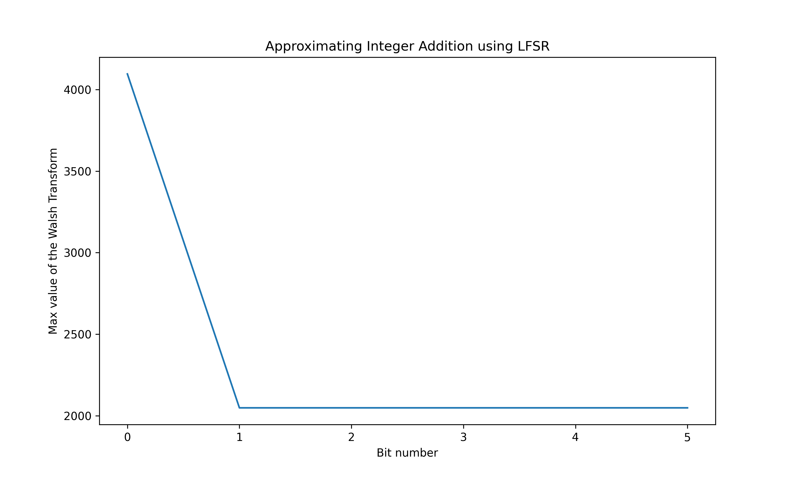
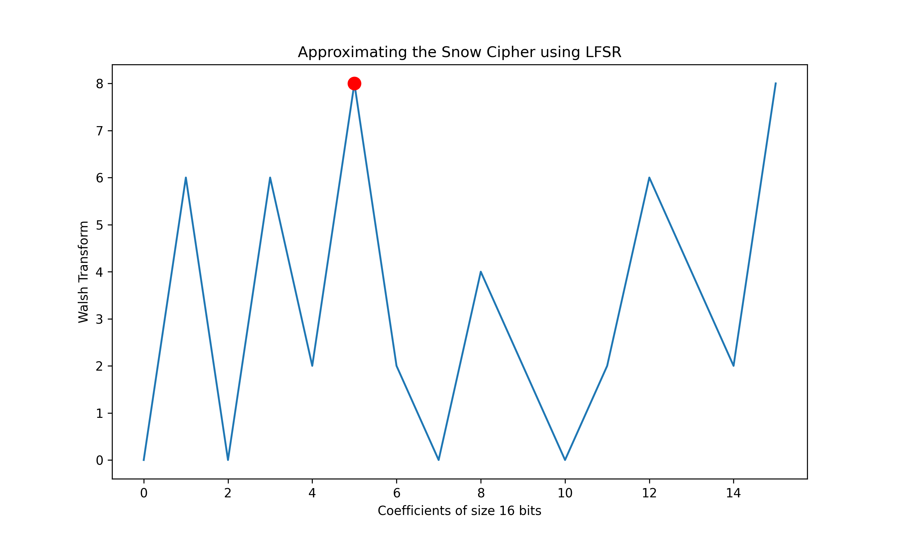

# EE636 Selected Topics in Information Theory Assignmeny

## Personal Info
Name of Student : Vighnesh Deshpande
Roll No         : 200102112
Branch          : ECE


## Introduction
This is the code for the assignment which contains the following 2 questions:
1. Approximating integer addition using a LFSR with the help of Walsh Transform
2. Analyzing the output of SNOW Stream Cipher and and use Walsh Transform to see if the output of the walsh transform can be pproximated by a LFSR.


## Installation and Setup of Dependencies
This Assignment Uses the CryptoMobile Library([Code](https://github.com/mitshell/CryptoMobile))
The standard installation process is to use the CPython build environment to compile
C files and install them together with the Python wrappers. The Milenage and EEA2/EIA2
algorithms moreover require one of the following Python cryptographic library to support
AES:
- [pycryptodome](https://www.pycryptodome.org/) or
- [cryptography](https://cryptography.io/en/latest/)

The ECIES module requires the last one (cryptography) to work, as no support for ECIES 
with pycryptodome as been developped yet.


This library supports both Python 2.7 and 3.X versions.
An installation script is available: it installs the library within your Python 
package directory:
First change directory to snow
```
cd snow
```

```
python setup.py install
```
or to make a system-wide install
```
sudo python setup.py install
```

It is also possible to test the library before installing it:

```
python setup.py test
```

Or to simply build the library without installing it in the system:

```
python setup.py build
```

For generic info on building C extensions on Windows, see the 
[Python wiki](https://wiki.python.org/moin/WindowsCompilers).
When building on a Windows system using the MSVC compiler, the .c files will be automatically
renamed to .cc by the install script in order to get them compiled correctly by the MSVC compiler.

To be noted also that the library builds and runs fine with pypy3.


### Installing the ctypes version instead of the CPython wrappers
There is still the possibility to install manually the historical version (before 2019) 
of the library which uses Python-only _ctypes_ source files. A *CM_ctypes.py* is available 
in the \_ctypes directory for this purpose.
Please note that this part is not supported anymore, no more tested, and may not work correctly
or even at all.


## Usage
The folder SNOW contains the code of the library to generate SNOW Cipher
Q1.ipynb contains the code for the solution to the first question
Q2.py contains the code for the solution to the second question
To run the code for Q1 run the command:
```
python Q1.py
```


You can also open Q1.ipynb in a Jupyter Notebook and run all cells.

To run the code for Q2 run the command:
```
python Q2.py
```


The folder plots contains the result plots


